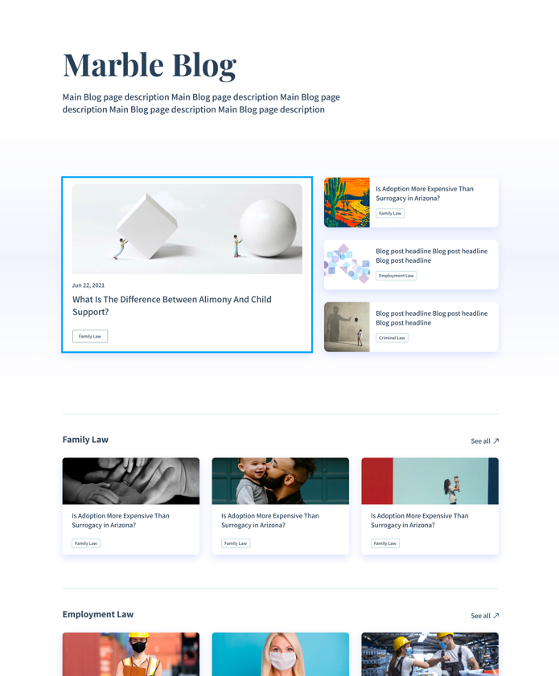
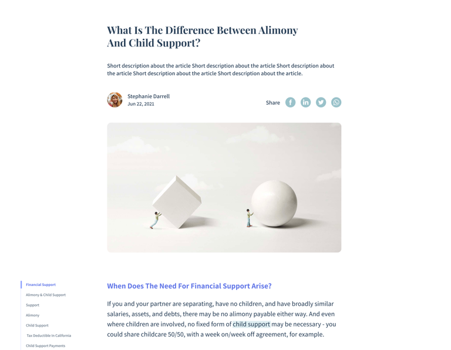

# Welcome to Marble's Frontend Candidate Exercise

In this assignment you will be asked to use the existing application skeleton and implement the pages described in 
the mockups attached

#### Screenshots:

\

### Designs:
Designs are located in the following link:\
https://www.figma.com/file/7QEqJhEJ3qEF7OR1I46IIq/FE-Excercise?node-id=0%3A1\
use inspect feature to get design definition such as colors, spacing, text size etc.

### Getting Started
Clone this repo\
run: `yarn` to install all packages\
run `yarn start` to start the dev server\
Implement\
Zip folder\
Send back to us by mail

### Approximate exercise time:
2-4 hours

### Action Items
- Home Page - Implement the UI (Desktop only) according to the designs (see "Design" section).
- Home Page - Should show a loading indication while loading the data from the server. (svg resource can be found here: 'src/assets/svg/loader.svg')
- Home Page - Clicking on an Article should navigation to /article/<article-slug> (slug is a key defining an article, and is part of data returned from the api)
- Article Page - Should read the <article-slug> from the url, and retrieve the rest of the article's data using an api call similar to the one in Home Page.
- Article Page - Should show a loading indication while loading the data from the server.
- Article Page - Should display the raw data retrieved.
- Bonus: Implement the UI (Desktop only) of the article 

### Few Notes
- Code should be clean and readable (eslint and prettier already setup, use them)
- Split into components.
- Styling can be done by any method. We prefer [styled-components](https://styled-components.com/) which is already installed.
- Typescript is optional.
- You are welcome to use any external library you see fit.
- Try to be as close as possible to the designs provided (pixel perfect).
- We use storyblok (a 3rd party tool) to retrieve the articles data, you can use this graphql playground to see the schemas and test queries\
  https://gapi-browser.storyblok.com/?token=HwsawDuLR2g1sBoukqkPDQtt
